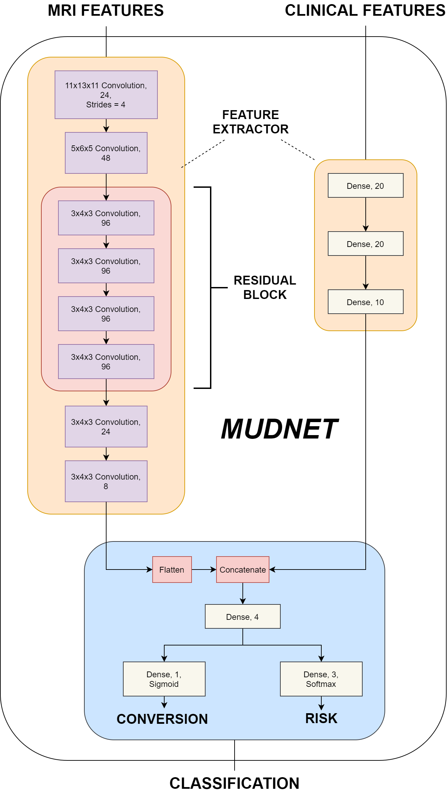
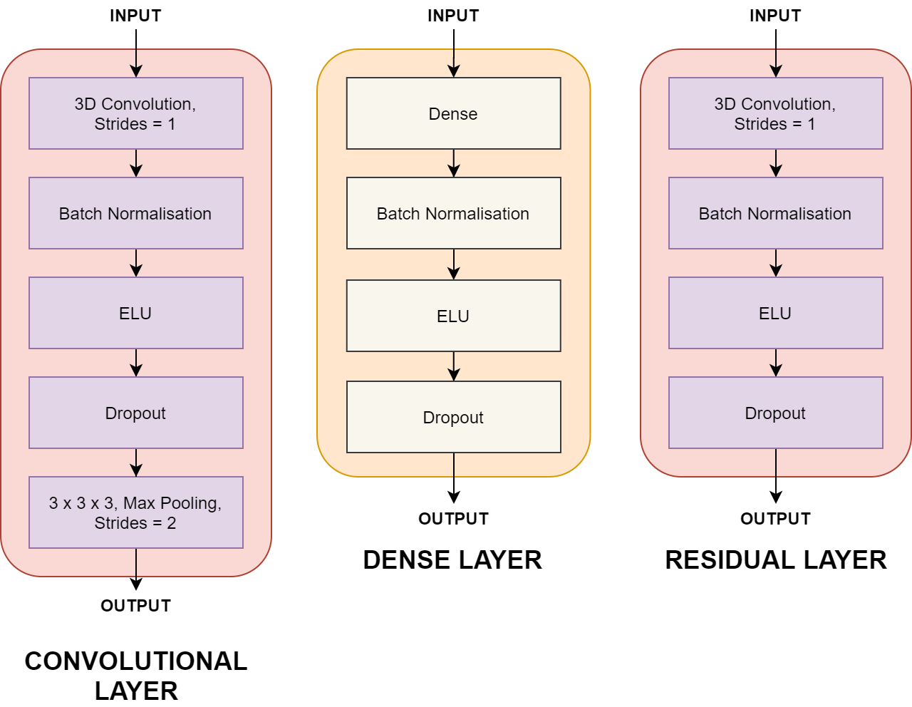
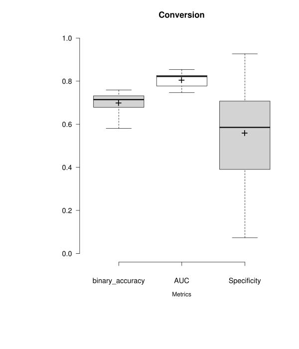
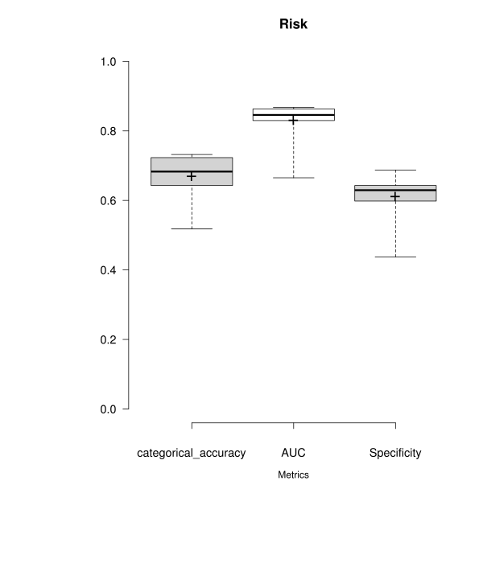

## Brain Image Analysis using Deep Learning
A multimodal deep learning approach to the early prediction of mild cognitive impairment conversion to Alzheimer's Disease.
## Abstract
Mild cognitive impairment (MCI) is the intermediary stage before Alzheimer’s Disease – many patients however remain stable or even revert back to normal cognition. Early detection of progressive MCI (pMCI) therefore can be utilised in identifying at-risk individuals and directing additional medical treatment in order to reduce or even prevent the conversion to AD.

This dissertation presents a 3D convolutional neural network – MudNet, to utilise deep learning in the early detection of pMCI patients while simultaneously predicting their time-to-AD class. Predictions for progressive/stable MCI classes as well as time-to-AD are made with risk classifications where high-risk pMCI patients see conversion to AD within 24 months and low-risk patients greater than 24 months.

MudNet is trained and validated using baseline clinical and volumetric MRI data (n = 559) from participants of the Alzheimer’s Disease Neuroimaging Initiative (ADNI). The model utilises T1-weighted structural MRIs alongside clinical data which also contains neuropsychological (RAVLT, ADAS-11, ADAS-13, ADASQ4, MMSE) tests as inputs.
The averaged results of the model indicate a binary accuracy of 69.8% for conversion predictions and a categorical accuracy of 66.9% for risk classifications. Its subpar performance achieves better than random results but is outperformed by current research.
## Overview
This repository contains the code for the convolutional neural network - MudNet that identifies AD-converters and their risk of conversion within a 24 months.
* ```train.py``` defines that model training and its parameters
* ```train_crossval.py``` is the cross-validation implementation for evaluating the model
* ```utils``` folder contains:
  * ```callbacks.py``` extracts model metrics
  * ```data_loader.py``` loads and prepares structural MRI and clinical data
  * ```model.py``` defines MudNet layers and parameters
  * ```preprocess.py``` contains data splitting and pre-processing methods (i.e. train-test split, one-hot encoding etc)
## Model Architecture
<br></br>

<br></br>
<br></br>

<br></br>
## Results
 
